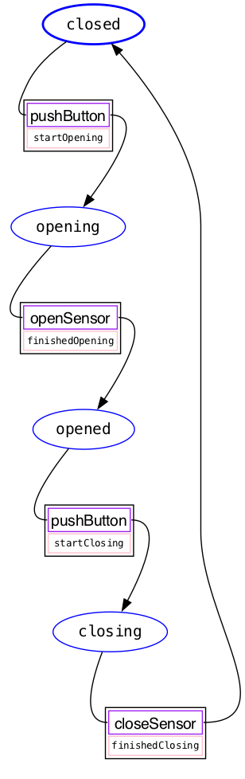

================
 Visualizations
================

Installation
============

To create state machine graphs you must install `automat` with the graphing dependencies.

.. code-block:: bash

    pip install automat[visualize]

To generate images, you will also need to install `Graphviz
<https://graphviz.org>`_ for your platform, such as with ``brew install
graphviz`` on macOS or ``apt install graphviz`` on Ubuntu.

Example
=======

If we put the garage door example from the tutorial into a file called ``garage_door.py``,

You can generate a state machine visualization by running:

.. code-block:: bash

    $ automat-visualize garage_door
    garage_door.machineFactory ...discovered
    garage_door.machineFactory ...wrote image and dot into .automat_visualize

The `dot` file and `png` will be saved in the default output directory, to the
file ``.automat_visualize/garage_door.machineFactory.dot.png`` .

``automat-visualize`` help
==========================

.. code-block:: bash

    $ automat-visualize -h
    usage: /home/tom/Envs/tmp-72fe664d2dc5cbf/bin/automat-visualize
           [-h] [--quiet] [--dot-directory DOT_DIRECTORY]
           [--image-directory IMAGE_DIRECTORY]
           [--image-type {gv,vml,dot_json,imap_np,pov,tiff,pic,canon,jpg,ismap,sgi,webp,gd,json0,ps2,cmapx_np,plain-ext,wbmp,xdot_json,ps,cgimage,ico,gtk,pct,gif,json,fig,xlib,xdot1.2,tif,tk,xdot1.4,svgz,gd2,jpe,psd,xdot,bmp,jpeg,x11,cmapx,jp2,imap,png,tga,pict,plain,eps,vmlz,cmap,exr,svg,pdf,vrml,dot}]
           [--view]
           fqpn

    Visualize automat.MethodicalMachines as graphviz graphs.

    positional arguments:
      fqpn                  A Fully Qualified Path name representing where to find
                            machines.

    optional arguments:
      -h, --help            show this help message and exit
      --quiet, -q           suppress output
      --dot-directory DOT_DIRECTORY, -d DOT_DIRECTORY
                            Where to write out .dot files.
      --image-directory IMAGE_DIRECTORY, -i IMAGE_DIRECTORY
                            Where to write out image files.
      --image-type {gv,vml,dot_json,imap_np,pov,tiff,pic,canon,jpg,ismap,sgi,webp,gd,json0,ps2,cmapx_np,plain-ext,wbmp,xdot_json,ps,cgimage,ico,gtk,pct,gif,json,fig,xlib,xdot1.2,tif,tk,xdot1.4,svgz,gd2,jpe,psd,xdot,bmp,jpeg,x11,cmapx,jp2,imap,png,tga,pict,plain,eps,vmlz,cmap,exr,svg,pdf,vrml,dot}, -t {gv,vml,dot_json,imap_np,pov,tiff,pic,canon,jpg,ismap,sgi,webp,gd,json0,ps2,cmapx_np,plain-ext,wbmp,xdot_json,ps,cgimage,ico,gtk,pct,gif,json,fig,xlib,xdot1.2,tif,tk,xdot1.4,svgz,gd2,jpe,psd,xdot,bmp,jpeg,x11,cmapx,jp2,imap,png,tga,pict,plain,eps,vmlz,cmap,exr,svg,pdf,vrml,dot}
                            The image format.
      --view, -v            View rendered graphs with default image viewer

    You must have the graphviz tool suite installed. Please visit
    http://www.graphviz.org for more information.
