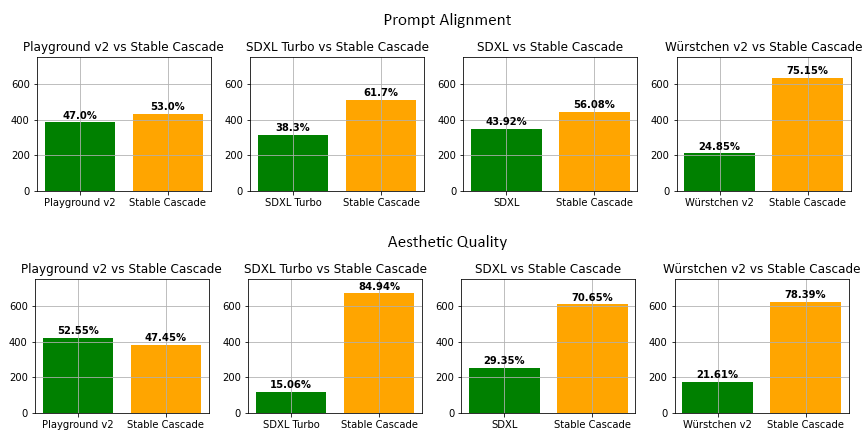

# Stable Cascade模型
该模型基于Würstchen架构构建，与稳定扩散等其他模型的主要区别在于它在更小的潜在空间中工作。为什么这很重要？潜在空间越小，推理速度就越快，训练成本也就越低。潜在空间有多小？稳定扩散使用压缩因子 8，从而将 1024x1024 图像编码为 128x128。 Stable Cascade 的压缩系数为 42，这意味着可以将 1024x1024 图像编码为 24x24，同时保持清晰的重建。然后在高度压缩的潜在空间中训练文本条件模型。与稳定扩散 1.5 相比，该架构的先前版本实现了 16 倍的成本降低。



## 模型权重
### 下载预训练权重
```
wget https://paddlenlp.bj.bcebos.com/models/community/baicai/pp_stable_cascade/stable_cascade_weights.tar.gz
# 解压到./stable_cascade_weights
mkdir stable_cascade_weights
tar -xzvf stable_cascade_weights.tar.gz -C ./stable_cascade_weights
```
如果解压到其他目录，请修改config.py中的`WEIGHTS_PATH`。
如要自行转换预训练权重，请参考以下脚本：
- scripts/convert_other_weight.py
- scripts/convert_unet_weight.py

## 模型推理
```
python inference.py
```
其代码如下
```python
from ldm.model_c import ModelC
from ldm.model_b import ModelB

model = ModelC()
model.eval()
model_b = ModelB()
model_b.eval()

caption = "A beauty girl in winter"
batch_size = 2
seed = 1
image, latent_c = model.log_image(caption, seed=seed, batch_size=batch_size)
image_b, latent_b = model_b.log_image(latent_c, caption, seed=seed, batch_size=batch_size)
from PIL import Image
for i, image_i in enumerate(image_b):
    Image.fromarray(image_i).save('./result_{}.png'.format(i))
```
-- caption，在其中输入我们想要的画面内容
-- seed，随机种子，控制生成图片的随机性
-- batch_size，批量大小，控制生产图片数量
保存的图片为result_0.png、result_1.png
输出示例：


## 模型微调训练
单机单卡训练
```
sh train.sh
```
内容如下：
```shell
TRAINING_PYTHON="python -u"
${TRAINING_PYTHON} train_stage_c_trainer.py \
    --do_train \
    --dataset_path /root/lxl/0_SC/Paddle-SC/dataset/haerbin \
    --output_dir ./train_output \
    --per_device_train_batch_size 1 \
    --gradient_accumulation_steps 1 \
    --learning_rate 1.0e-4 \
    --weight_decay 0.01 \
    --max_grad_norm 1.0 \
    --max_steps 1000 \
    --lr_scheduler_type "constant" \
    --warmup_steps 0 \
    --image_logging_steps 1000000 \
    --logging_steps 1 \
    --save_steps 5000 \
    --save_total_limit 50 \
    --seed 1 \
    --dataloader_num_workers 0 \
    --num_inference_steps 200 \
    --model_max_length 77 \
    --fp16 ${USE_AMP} \
    --fp16_opt_level=${fp16_opt_level}
```
其中重点关心以下内容：
--dataset_path 训练数据集路径，需要在文件夹中包含0001.jpg、0001.txt、0002.jpg、0002.txt这样的训练集，其中0001.jpg为图片，0001.txt为图片对应的文本描述。
--learning_rate 1.0e-4 训练学习率
--per_device_train_batch_size 1 每张卡中批量大小
--max_steps 1000 训练步数
--output_dir ./train_output 训练后保存路径
训练后保存后文件在train_output文件夹中，可以参考scripts/extract_unet_weights.py提取出训练好的unet权重。
