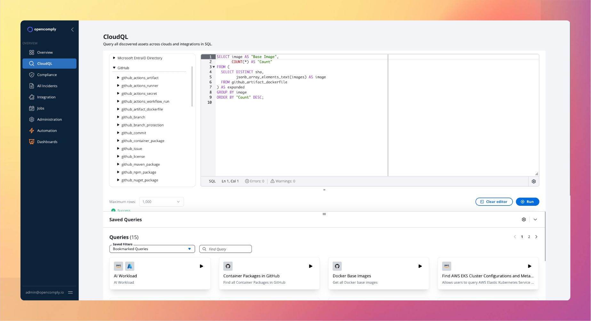

<p align="center">
  <a href="https://opencomply.io">
    <picture>
      <!-- Dark mode logo -->
      <source media="(prefers-color-scheme: dark)" srcset="https://github.com/opengovern/opensecurity/blob/main/assets/logos/logo-dark.svg">
      <!-- Light mode logo -->
      <source media="(prefers-color-scheme: light)" srcset="https://github.com/opengovern/opensecurity/blob/main/assets/logos/logo-light.svg">
      <!-- Fallback/logo -->
      
    </picture>
  </a>
</p>


<p align="center"><em>(formerly opencomply)</em></p>

<p align="center">Simplify security and compliance across your entire stack—from containers to cloud—so you can ship faster and worry less.</p>

<p align="center">
  <a target="_blank" href="https://opensecurity.sh">Website</a> ·
  <a target="_blank" href="https://docs.opencomply.io">Docs</a> ·
</p>


<p align="center">
  
</p>

## What opensecurity Offers

* **Comprehensive Visibility:** Gain a clear view of your clouds and tools, including infrastructure, data, identities, configurations, and security posture.
* **Unified Compliance Management:** Streamline compliance checks for configurations, processes, and security in a single, centralized platform.
* **Automated Policy Enforcement:** Define custom rules (best practices, regulatory, or internal) as code using SQL policies, manage them via Git, and seamlessly integrate with your existing tools and CI/CD pipelines.

## Key Features

* **🔍 Unified Visibility:** Effortlessly explore and analyze 1000+ assets (containers, cloud resources, and more) using intuitive SQL queries.
* **⚙️ Customizable Controls:** Define compliance checks as SQL policies, leveraging the power of version control with Git.
* **✅ Flexible Compliance:** Easily create custom, intricate compliance checks tailored to your specific needs.
* **📈 Scalable Audits:** Efficiently manage thousands of checks across even the largest infrastructures.
* **🔗 Broad Integrations:** Seamlessly connect with popular platforms like AWS, Azure, DigitalOcean, Linode, GitHub, and many more.

## Why Choose opensecurity?

* **Integrated Security & Compliance:** Manage security and compliance in a unified manner, simplifying audit processes.
* **Automated Governance:** Continuously monitor and enforce policies, significantly reducing manual effort.
* **Developer-Friendly Approach:** Define compliance as code, integrating smoothly into your development workflow.
* **Scalable & Adaptable:** Grow with your infrastructure and adapt to your unique compliance requirements.

## 🚀 Quick Start: Get Up and Running in Minutes

Install opensecurity on any Kubernetes cluster with at least 3 nodes (4 vCPUs x 16GB RAM each).

```bash
helm repo add opensecurity https://charts.clearcompass.so --force-update
helm install -n opensecurity opensecurity opensecurity/opensecurity --create-namespace
kubectl port-forward -n opensecurity svc/nginx-proxy 8080:80
```

Open http://localhost:8080/ in your browser and sign in with `admin@opensecurity.sh` as the username and `password` as the password. The application comes pre-loaded with sample data.

## Next Steps

* **Explore the Documentation:** Dive deeper into Opensecurity with comprehensive guides and information at [docs.opencomply.io](https://docs.opencomply.io).
* **Try Cloud for Free:** Schedule a meeting to explore our hosted Cloud offering and experience the benefits of Opensecurity without the setup: [Schedule a Meeting](https://cal.com/team/opensecurity/try) 
